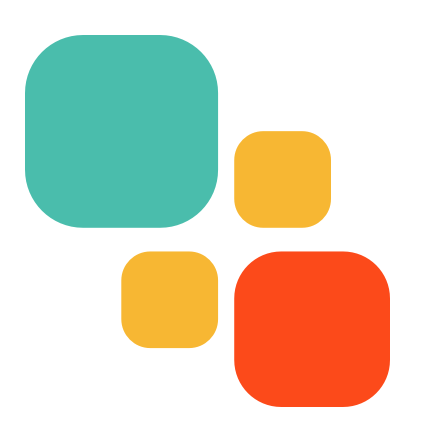

# College Portfolio

##  byt8

byt8 is my first iOS app that is published on the App Store.  This project arose from so many of my friends and family struggling to have a productive, meaningful day throughout quarantine and now working remotely.  I personally never journal or use any journaling apps; however, every night before bed find the time to scroll through instagram or twitter for a few minutes.  This is where byt8 came to life -- every day, the app prompts 8 binary, yes/no styled questions designed to help you easily reflect on the day, while it automatically collects some data your iphone inherently is tracking.

Check out https://byt8.app

 

## Bus Simulator

During my spring semester of sophomore year, I took a class called Software Design and Development. This class is entirely centered around learning C++ and applying it to a single, semester-long, project.  This project is a simulation of the university's transit bus system.  The goal of this project is to learn various programming skills and styles, proper documentation skills, and understanding the raw C++ skills necessary for a fast and functioning web application along with forming a software development mentality using various project management paradigms.

 

## COVID-19 Dashboard

The COVID-19 Windows application demo is one of my more recent project which I built out of boredom during my quarantined semester.  In the project, I have two different revisions.  The first one was my first ever project using C# and visual studio.  After 6 months of working in C#  (internship and some part time work through college), I decided to redo some of the core things about it.

 

## Angular Website

After building out a basic resume app in React, I decided to I decided to copy cat the app but in Angular this time.  This is completely mimicking the initial version, but has changed tech stack and has been refactored some.  If you want to view the hosted version, it is available at https://sather.ws.

## React Website

I decided I wanted to start from scratch and use create-react-app to build out a frontend React app for a personal resume.  From there, I did some experimenting with Docker so you can explore the container images at [Docker](https://hub.docker.com/repository/docker/willsather/website).

 

## Web Server

During my fall semester of my junior year, I was in a Introduction to Operating Systems class at University of Minnesota. This class was focused on the low-level intricacies of a machine's operating system.  This is one project of two projects all semester in which we built a functional web server.  This server was able to process GET requests and return a variety of images that were being hosted on the computer.  This allowed us to not only learn the basics on socket programming, but also have a working, templated out web server that we can base future projects on.

 

thanks, y'all

 
 

 

 [![Website: sather.ws](https://img.shields.io/badge/-sather.ws-gray?style=flat-round&logo=data:image/png;base64,iVBORw0KGgoAAAANSUhEUgAAADIAAAAyCAYAAAAeP4ixAAAABmJLR0QA/wD/AP+gvaeTAAAFdklEQVRoge2ZW4hVZRTH1zYvo0wXKzS7wDSNEk1DF3sYpdIsdCxpkkwreuvBF0UrKHQEmbCsIDKky0MQQaVIoShmGV000cC0hPQhsyRnNHPKMW1szJlfD9/anTX77O+cvefsM3MeWrBZZ6/bt/7nu+71ifxPlUVBFkGAahG5Q0SmiEi9iIwXkTEiUq0mZ0TkuIgcFJH9IrJNRHYEQXAmi/ZLIiAAZgLrgL9JT2eBtUATkMkf2h8Qc4B9ngSPAM8Ck4zsVmAJcNjj8x0weyAB1AGfmgR+BTr193ngRdwwC+0BMO8jgOVqC3ACOGbifQzUlhvEo8CfJoFF+s8DdANzYnz6ADHyJuAvVT8NLNSYAKeAeeUAEAArzL+2ARgL3A306DPL4xsLxID5R59GjbnetNOaNYjXzNBZoPKLcHMBYEUBfy8Q1T+jJj8CVSpbYIbe6qyAhD3RhZmMwAsq3wUMLQHIEGCnmrUY+QPaZuk9g5sT6NBpNvJxuKUTYHKRGAWBqM0tQC9u/o028mZtG2Buf0HUkZvYT0Z0z6l8U4I4RYGo3Qdquiwif0LlnRRZzWI3IuAjEZlZLIEBpq1BEMzwKYdEBbhltNJAiIhMt0O8IOFWqXDHXhyjf1t1SxPGSzS01Hapmr8Zo1uoum9JcpzBnZ0A2tHl0OgC4KjqbywDkAY1PxyjqwLaVO8dXtZhnRq3xOiuV92xJImpT2Igan9cXfImNtCiujXFglyIW1Z7gZoY/WMaaH2KxNIC2aAueUcUoEZz6wJGRfV2st8uIlUisjsIgrzuFZGblO9Jmlg/aK/ym6MKzWm3iIwUl2sfskCmKN/uaeQ65Qf7l2Mi+iHSVpS+Uj41qrBA6pXv9AQJh9tPqVJLRz8rv9aj36W8PqqwQCZEgkXpUuUdqVJLRyeUX+7Rh7lNiCoskMuUt3mCXKz8ZKrU0tFv4r7vL/HojyjPA/rf5gJ0i8jwzFPzUBAEvuNRo4hsltwIiKPuIAj67HN5R5TBpiAIvhY3mQvtV/7dHejQNTx2fAInVe/r9jifRPsI8DnwDTCuiN1YDflHVGd7JJzEV3vinFI+2qMvhe4SkYkisgPwrVgiIlcpz+stCyRcw33n/vBf8K0oWVCtODA3ePTh/nIoqrBA9iuf5AkSLn3lLNd8ISJXish24LYYfaPyvL3OAtmm/E5PI+FGOL4/GSake0Vkk7it4DMguoOHNbMvvRGA6sE6NFo7YBjwnoq6MKUmYDjwFjCsWMC1GmBZjK5sx/ioHa668rqKzwGPJG0zDNCkzu3AyIjOflg1lBOIka9UVQ8wPzkS57xHnQt96uZ9eKVJMI0drojXqybLk7QbOs5mACgNYGA+uRrXyjRgNlcSELV5GDdfAN4Aih+vgFpcVRzgqYiuHAW6pHazyJVS36XY6qVO89Shh7513yvIsGSaxk5tp5Krgm4kUu3xObWqw1ngQSPPpIidxA63v20FDpknHC2JRkYYaLXpmUUqy+RaISGQOnKrVhx9nwiIBms1jhtxw2saJVz0+OyAC4CXgVVG/4mavIqbv/ZJ9zEIzDVd2gEsNgC7gYeSAgHui7NTEO+b92mqv0ffjwIjUiXuAVMLbDENRS9DX6LwZWgV7t7xvAdICCIcSluMzV6VPV4yEBO02QSOUhvupmuykU3ElTx/ieuliH8nrgZ9WgE1qE148XSAJHtICjABMANYQ25tT0weIJ244oMAq1T2jr4PJXdPf39mQCKJjAKmA8/j6rcHgN9xc6dLe2kf7tZ2CTr2jX87bv41GlkN7sb3HHCNysJDpK8aOriEWwXHxMjD75IPcXtJSL7aW2US7qLU0mngFcBXIKlcwp2p2nRIlqOCU1n0LzCNczpVfNqOAAAAAElFTkSuQmCC&logoColor=white&link=https://sather.ws)](https://sather.ws)
