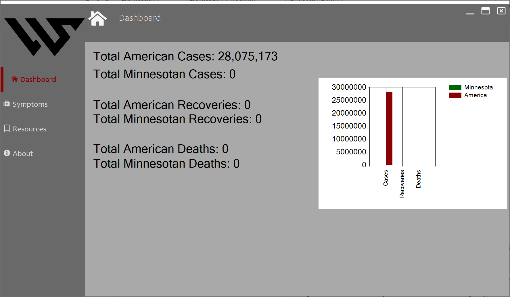
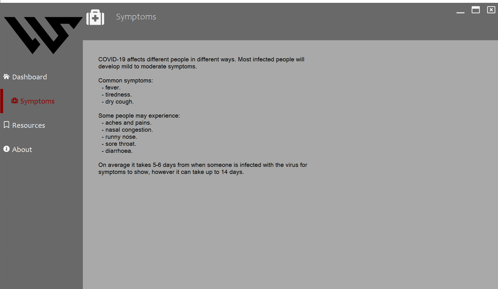
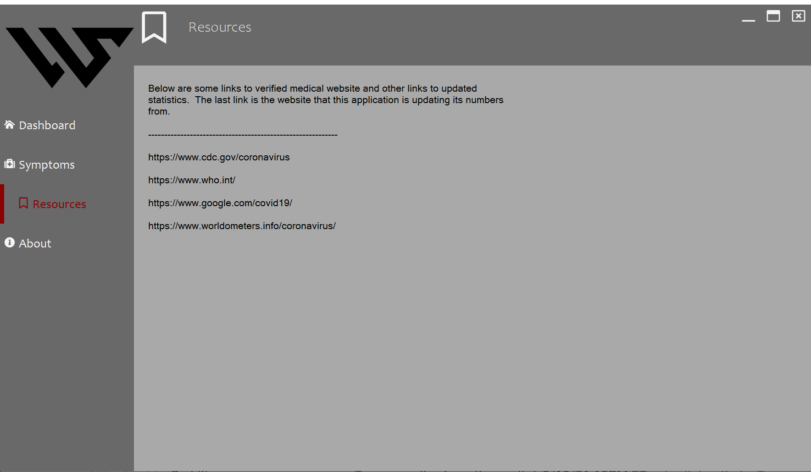

# COVID-19 Demo (C#)

### Will Sather
##### Last Updated: February, 2021

 

### Version 2
---
API Consumption of COVID-19 statistics

    This massively improved the runtime and reload times required to constantly update the data.  Previously parsing HTML from a webpage took seconds while this is radically faster.

Project Cleaniness

    Previously, overall file management and CsProj files were a mess.  It is now easier to find, edit, and test files within the directory

 

### Version 1
---
View real-time COVID-19 data
    
    View raw number data and visual graphs of the current COVID-19 case counts, recoveries, and deaths.  

Find the proper resources & precautions

    Easily accessible links to data and CDC recommendations are directly available on their own tab. 

 

## Project Description
The COVID-19 Windows application demo is my most recent project which was built out of boredom during my quarantined semester.  In the directory, I have two different versions.  The first one was my first ever project using C# and visual studio.  After 6 months of enterprise C# development (internship and part time work), I decided to redo some of the core functionality.  Some of the benefits of the second version is a massive runtime improvement, implemented a API consumption using JSON, and just overall better file management and code health.  This project has been an ongoing one and I will continue to upgrade it as I have the time.  I am now working on implementing feature to change specified state, asynchonrous loading with UI toggles, and overall a cleaner more usable user interface that meets Microsoft's standards.  I will continue to keep each version of this demo on git as to show my overall improvements and code growth.  

 

## Screenshots

 

 
 
 

 
 
 

